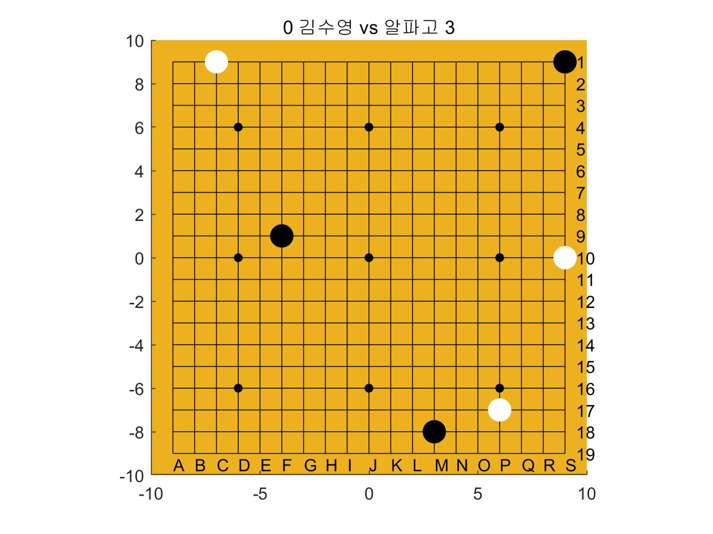
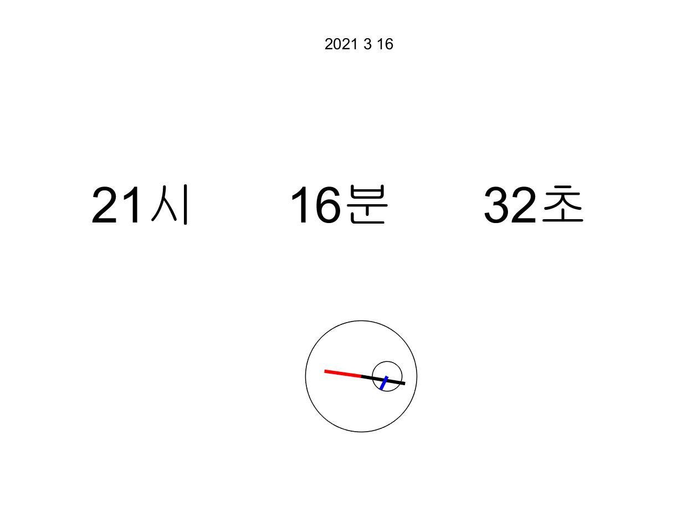
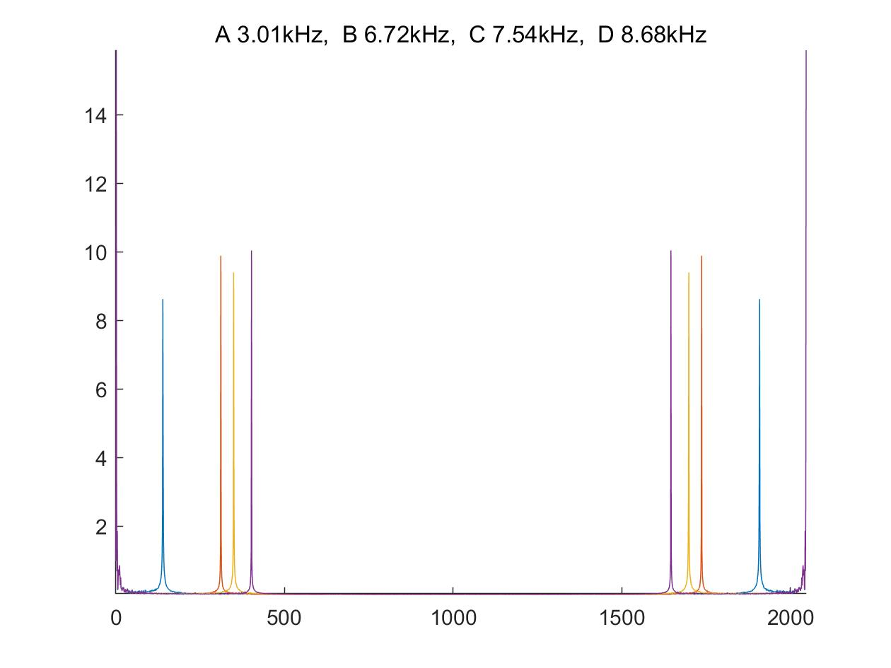
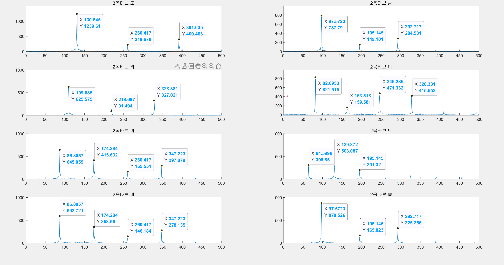
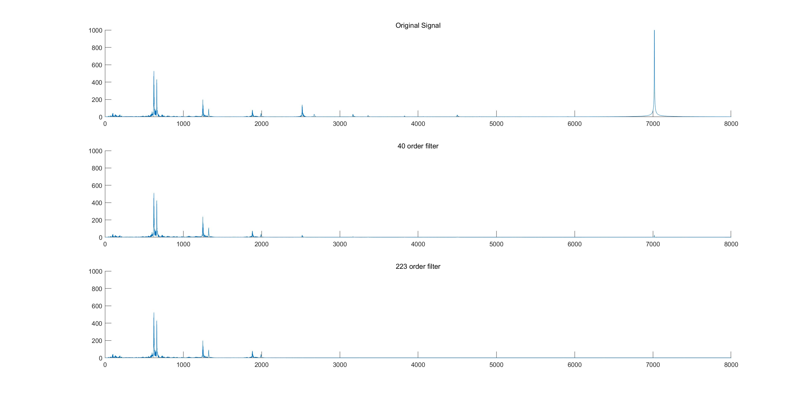

# DSP Matlab Codes

## 2021 한양대학교 DSP 실습 수업 중 자료

ALl this codes written in `Matlab`

## Project1 - Checkerboard 

Plot drawing practices with Matlab 😎

 

## Project2 - Matlab Clock

Dynamic Plot `set` practices with Matlab Clock 🕗

 

## Project3 - Music FFT

Apply FFT to Music Data with Matlab `fft` function 🎷

 

## Project4 - Guess Note from Music

Extract each note from the sound source and use `fft` to find out which note it has. 🎼

 

## Project5 - Low Pass Filter Noise Cancelling 

Original music sounds noisy, make proper `LPF`, then cancel noise from original music source. 🎚

 
